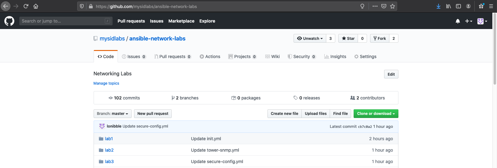

# Ansible F5 Automation Immersion Day Workshop
You will use Ansible commands and playbooks to explore and reconfigure a F5 in a virtual environment.  Note, that even though we are using a virtual environment, this is not a requirement, everything we do, can be done on physical devices.   

The Immersion Day is meant as a follow on to the Network Automation Immersion Day.  Some content will be review but in respect to using Ansible with F5.  While you can go through these labs there may be concepts that were covered previously that we will not cover as it is expected that these concepts are already understood.  Throughout the labs we hope to share some additional features, elements, good and bad practices and patterns to using Ansible for Automation. 

You will be required to modify some files during the course of this workshop.  You will not be required to write your own playbooks as this would require much more time.  The playbooks used are open source and thus free to use and modify.  That being said, writing playbooks and running them in a test environment is one of the best ways to learn.   
## Outline
* Part 1: Getting setup
    * Fork Git Repo
    * SSH to jump station 
    * Connecting to F5 
    * Downloading forked Git Repo 
* Part 2: Basic F5 labs 
  * Explore the lab environment 
  * Modify files in Git Repo 
  * Gather data from F5 
  * Adding nodes to F5 
  * Adding a load balancing pool 
  * Adding members to a pool 
  * Adding a virtual server 
  * Adding and attaching an iRule to a virtual server 
  * Save the running configuration 
* Part 3: F5 operational labs 
  * Disabling a pool member 
  * Deleting F5 configuration 
  * Error Handling 
* Part 4: F5 AS3 labs 
  * Intro to AS3 
  * Operational change with AS3 
  * Deleting a web application 
* Part 5: Tower labs 
  * Explore Ansible Tower 
  * Create an Ansible Tower job template 
  * Create an Ansible Tower workflow 
  * Create a node maintenance workflow 

***Note:  Assume the output shown in the examples below will be different to yours.***

## Part 1: Getting setup
### Overview
* Fork the lab github repository to your own repository so you can edit and modify. 
* Accessing the jump station 
* Downloading your forked repository to the jump station 

### Fork the Sirius Ansible networking GitHub Repository
1. Login to [Github](https://github.com)
1. Go to [https://github.com/mysidlabs/f5-ansible-labs](https://github.com/mysidlabs/f5-ansible-labs)
1. Click on the Fork button in the upper-right section of the page:



>***Note: Once forked, you can modify all files within Github***


### Connect to your jump host
*Step 1*
SSH to your jump box at `siduser###.jump.mysidlabs.com `

For MacOS or Linux users the following is an example using the terminal: 

```bash
$ ssh siduser<user_id>@siduser<user_id>.jump.mysidlabs.com 
```
e.g.
```bash
$ ssh siduser101@siduser101.jump.mysidlabs.com
```
You may get the following message, type **yes** at the prompt:
```bash
The authenticity of host 'siduser101.jump.mysidlabs.com (3.132.28.93)' can't be established. 
ECDSA key fingerprint is SHA256: xxxxxxxxxxxxxxxxxxxxxxxxxxxxxxxxxxxxxx 

Are you sure you want to continue connecting (yes/no/[fingerprint])? Yes 

Warning: Permanently added 'siduser.jump.mysidlabs.com,3.132.28.93' (ECDSA) to the list of known hosts. 
```

> ***Note: You can remove from known hosts when workshop is completed.*** 

When prompted for your password type in the password the instructor provides 

password: ******* 

 

For Windows users the following is an example using Putty: 

 Type jump.mysidlabs.com in the Host Name box and click the Open button 

    User and password for F5 BigIP: admin  / Mys1dlabspw!


For Windows users the following is an example using Putty: 

 Type jump.mysidlabs.com in the Host Name box and click the Open button 
 


User and password for F5 BigIP: admin  / Mys1dlabspw!

##### Click the Yes button to accept the ssh key 


##### Type in username and password in the terminal screen at the appropriate prompts 


#### Connecting to your F5

*Step 1*

    Open your web browser (Chrome or Firefox)


*Step 2*
```bash
Put the address of your F5 in the address bar including the port number 8443
`https://siduser155.f5.mysidlabs.com:8443`
``` 
*Step 3*

    Proceed through the warnings regarding the SSL certificate not being valid


>****Note: Some browsers will not allow you to connect/bypass the security warning due to settings and the fact that the SSL
certificate is a self-signed certificate and cannot be validated. You may have to change browsers in order to bypassthe
security warning.****

*Step 4*

    Record the F5 Private IP address


*Step 5*

Login into the F5 BigIP

    Username: admin

    Password: Mys1dlabspw!


#### Download repository to jump station 

*Step 1*

Your terminal prompt should change to something like the following:
```bash
siduser250@jump:~$
```
*Step 2*

Type in ‘lab ansible’ at the promt:
```bash
siduser101@jump:~$ TAG=1.3.1 lab ansible
```

*Step 3*

Your terminal prompt should change to something likethe following:
```bash 
siduser250@toolkit ~ #
```

*Step 4*

Clone your repository
```bash
siduser250@toolkit ~ # git clone https://github.com/<<YOUR_GITHUB_USER>>/ansible-f5-labs
```    
    
> :exclamation: ***Tip: The usage of git becomes very important to “infrastructure as code”. Everything resides in github including your
changes. If you lose connection from the jump box, the repository will be deleted automatically. All you need to
do is clone your repository and you are back to where you were.***


*Step 5*
```bash
You should now see the repository in your directory
siduser250@toolkit ~ # ls
ansible-f5-labs dev
```

*Step 6*
```bash
    Move into the ansible-network-labs directory
    siduser250@toolkit ~ # cd ansible-f5-labs
    siduser250@toolkit ~/ansible-f5-labs #
```

##### Additional Information 

 You can now explore the labs directory

```bash
cd = change directory
ls = list contents
pwd = display current working directory
cat = display file
nano or vim = file editor
tree = display file structure from current directory
```

## Part 2: Basic F5 labs
### Topology 

The topology is simple for the sake of learning some ansible basics. The diagram below is an example, the XXX in the hostname is
your Student ID. If you are student 199 then the hostname for the F5 would be siduser199.f5.mysidlabs.com.


## Lab1.0: Explore the lab environment 

*Step 1*

Make sure you are in the ansible-f5-labs folder
```bash
siduser250@toolkit ~/ansible-f5-labs # pwd
/home/siduser250/ansible-f5-labs
    
If you are not, change to the ansible-f5-labs directory
siduser250@toolkit ~ # cd ~/ansible-f5-labs/
```

*Step 2*
```bash
Run the ansible command with the --version command to look at what is configured:
siduser250@toolkit ~/ansible-f5-labs # ansible --version
ansible 2.9.7
config file = /home/siduser250/ansible-f5-labs/ansible.cfg
configured module search path = ['/home/siduser250/.ansible/plugins/modules','/usr/share/ansible/plugins/modules']
ansible python module location = /usr/lib/python3.7/site-packages/ansible
executable location = /usr/bin/ansible
python version = 3.7.7 (default, Mar 13 2020, 10:23:39) [GCC 9.2.1 20190827 (Red Hat 9.2.1-1)]
```    
    
This command gives you information about the version of Ansible, location of the executable, version of Python, search path for themodules and location of the ansible configuration file.
    
    
   *Step 3*
   
Use the cat command to view the contents of the ansible.cfg file.
```bash
siduser250@toolkit ~/ansible-f5-labs # cat ansible.cfg

[defaults]
deprecation_warnings = False
gathering = explicit
retry_files_enabled = False
inventory = ~/ansible-f5-labs/hosts
connection = smart
timeout = 60
forks = 50
host_key_checking = False

[ssh_connection]
ssh_args = -o ControlMaster=auto -o ControlPersist=30m
scp_if_ssh = True
[paramiko_connection]
host_key_auto_add = True
[persistent_connection]
connect_timeout = 60
command_timeout = 60
```

> Note: the following parameters within the ansible.cfg file:inventory: shows the location of the ansible inventory being used
    
    
*Step 4*
    
    The scope of a play within a playbook is limited to the groups of hosts declared within an Ansible inventory. Ansible supports
    multiple inventory types. An inventory could be a simple flat file with a collection of hosts defined within it or it could be a dynamic
    script (potentially querying a CMDB backend) that generates a list of devices to run the playbook against
    
You will work with a file-based inventory written in the ini format. Use the cat command to view the contents of your inventory:

    siduser250@toolkit ~/ansible-f5-labs # cat hosts
    [lb:children]
    f5
    [f5]
    <<siduserID>>.f5.mysidlabs.com private_ip=<<privateIP>>
    [webservers]
    web1 ansible_host=3.136.84.180 private_ip=172.31.19.21
    web2 ansible_host=3.136.11.17 private_ip=172.31.20.204
    
    
*Step 5*
    
    In the above output every [ ] defines a group. For example [webservers] is a group that contains the hosts, web1 and web2.
    Note: A group called all always exists and contains all groups and hosts defined within an inventory.           
    We can associate variables to groups and hosts. Host variables are declared/defined on the same line as the host themselves. For


    example, for the host f5:
    <<siduserID>>.f5.mysidlabs.com private_ip=<<privateIP>>
    <<siduserID>>.f5.mysidlabs.com - The name that Ansible will use. Since this is an FQDN Ansible will do a DNS

lookup to get the IP address. We will need to modify this to a valid FQDN.
private_ip=<<privateIP>> - Because we are using AWS the F5 interface is assigned a private IP and then uses NAT
for its public IP.


*Step 6*
##### Modify your hosts file in your github repository
###### Step 6.a
###### Click on your host file 


###### Step 6.b
###### Notice the hostname and private_ip are invalid. Click on the pencil Icon on the right hand side to modify 


###### Step 6.c
*** Change <<siduserID>> to your siduser which was assign at the start of the labs. Change the private IP to the IP recorded in
Step 4 of the Connecting to your F5 section. The following example shows what it would be modified to if your siduserID
was siduser155 and the private ip was 172.31.13.240.***
    


###### Step 6.d
###### Scroll to the bottom of the page and click on the “Commit changes” button.


###### Step 6.e
###### Pull the changes you made to your repository down to the jump station.

    Make sure you are in the ansible-f5-labs directory
    siduser155@toolkit ~/ansible-f5-labs # pwd
    /home/siduser155/ansible-f5-labs
    Issue the git pull command
    siduser155@toolkit ~/ansible-f5-labs # git pull

    remote: Enumerating objects: 5, done.
    remote: Counting objects: 100% (5/5), done.
    remote: Compressing objects: 100% (3/3), done.
    remote: Total 3 (delta 1), reused 0 (delta 0), pack-reused 0
    Unpacking objects: 100% (3/3), 730 bytes | 730.00 KiB/s, done.
    From https://github.com/lonibble/ansible-f5-labs
    6d7e7c5..65b3753 master -> origin/master
    Updating 6d7e7c5..65b3753
    Fast-forward
    hosts | 2 +-
    1 file changed, 1 insertion(+), 1 deletion(-)
    
    
    
    
## Lab1.1: Using Ansible Vault  

*Step 1*

Look at the all.yaml group variable file. Notice it is not encrypted. 

    siduser150@toolkit ~/ansible-f5-labs # cat group_vars/all.yaml
    f5_username: admin
    f5_password: Mys1dlabspw!
    web_username: centos
    web_key: ~/.ssh/network-key.pem


*Step 2*

Encrypt all.yaml file and look at it again

    siduser150@toolkit ~/ansible-f5-labs # ansible-vault encrypt group_vars/all.yaml
    New Vault password:
    Confirm New Vault password:
    Encryption successful
    siduser150@toolkit ~/ansible-f5-labs # cat group_vars/all.yaml
    $ANSIBLE_VAULT;1.1;AES256
37646633316539343132663961316431323234383262653935393939343161366466333262626134
    3939396462623137643934316165653865393131643763390a393039306337323638323362613830
    34313765343462383533363936316231346231303030373830646638353066373632373766623537
    6634636330663663640a653730343433636431353364626138653532626131366566636439666466
    66653732653764616436306439363165656265306336653063343465313235393237323938653938
    33356633633130626663663264643030336261363339616433363134336538636237303532633262
    65396433643062326136383633343733383164633939643465623834663932366632396136303066
    33626334386436323031306336303135323337626432633863313431396431353639383933383563
    39643665653733633035653132633831393539386166613933323736633164643063
    
    
*Step 3*

Use view command to unencrypt and view the file

    siduser150@toolkit ~/ansible-f5-labs # ansible-vault view group_vars/all.yaml
    Vault password:
    f5_username: admin
    f5_password: Mys1dlabspw!
    web_username: centos
    web_key: ~/.ssh/network-key.pem

*Step 4*

Use rekey command to change the file encryption key

    siduser150@toolkit ~/ansible-f5-labs # ansible-vault rekey group_vars/all.yaml
    Vault password:
    New Vault password:
    Confirm New Vault password:
    Rekey successful
    
    
*Step 5*    

Use the “- - help” command to see what other options are available. Also review the ansible-vault documentation. 

Ansible-vault documentation [ansible docs](https://docs.ansible.com/ansible/latest/user_guide/vault.html#vault-ids-and-multiple-vault-passwords
siduser150@toolkit ~/ansible-f5-labs # ansible-vault --help)

    siduser150@toolkit ~/ansible-f5-labs # ansible-vault --help 
    

## Lab1.2: Gather data from f5  

*Step 1*

Look at the file called 1.2.1-bigip-facts.yaml

    siduser250@toolkit ~/ansible-f5-labs # cat 1.2.1-bigip-facts.yaml
    ---
    - name: GRAB F5 FACTS
    hosts: f5
    connection: local
    gather_facts: false
    << output omitted >>
    
 *Step 2*
 
 Ansible playbooks are YAML files. The extension for these files is typically, yml or yaml. YAML is a structured encoding format that is
also extremely human readable.

    --- - at the top of the file indicates that this is the start of the YAML file.
    hosts: f5 - indicates the play is run only on the F5 BIG-IP device
    connection: local - tells the playbook to run locally (rather than SSHing to itself)
    gather_facts: no - disables facts gathering. We are not using any fact variables for this playbook.
    
 *Step 3*
 
 Run the playbook:
 
    siduser250@toolkit ~/ansible-f5-labs # ansible-playbook 1.2.1-bigip-facts.yaml --ask-vault-pass
    << output omitted >>
    
*Step 4*

    Review the output and see what information is in the output. Notice the formatting is in JSON format.


*Step 5*

Look at the file called 1.2.2-bigip-filter-facts.yaml.

    siduser250@toolkit ~/ansible-f5-labs # cat 1.2.2-bigip-filter-facts.yaml
    << output omitted >>
    

*Step 6*

Review the output and see what information is in the output. Notice:

    var: device_facts['system_info']['base_mac_address']
    and 
    var: device_facts['system_info']['product_version']

    device_facts – This is the register variable created for the output of the information gathered by the

    bigip_device_info module

    system_info – This is the parent level of the JSON output of the information gathered by the bigip_device_info

    module

    base_mac_address and product_version – are the variable used to store the specific information
    

*Step 7*

Run the playbook:

    siduser250@toolkit ~/ansible-f5-labs # ansible-playbook 1.2.2-bigip-filter-facts.yaml --ask-vault-pass
    << output omitted >>
    
    
*Bonus Exercise*

For this bonus exercise add the following to the 1.2.2-bigip-filter-facts.yaml playbook

    - name: DISPLAY COMPLETE BIG-IP SYSTEM INFORMATION
      debug:
       var: device_facts
      tags: debug

***Note the “tags: debug: parameter (at the task level). Tags allow for flexibility when running playbooks.
Also add a facts tag to the gather facts play. Your play should look like the screenshot below:***


Now re-run the playbook with the --skip-tags-debug command line option.

    ansible-playbook 1.2.2-bigip-filter-facts.yaml --ask-vault-pass --skip-tags=debug
    ansible-playbook 1.2.2-bigip-filter-facts.yaml --ask-vault-pass --tags=facts,debug
    
The Ansible Playbook will only run three tasks, skipping the DISPLAY COMPLETE BIG-IP SYSTEM INFORMATION task


## Lab1.3: Gather data from f5  

*Step 1*

Look at the file called 1.3-bigip-node.yaml

    siduser250@toolkit ~/ansible-f5-labs # cat 1.3-bigip-node.yaml
    ---
    - name: BIG-IP SETUP
    hosts: lb
    connection: local
    gather_facts: false
 
    tasks:
    - name: CREATE NODES
    bigip_node:
    provider:
    server: "{{ ansible_host }}"
    user: "{{ f5_username }}"
    password: "{{ f5_password }}"
    server_port: 8443
    validate_certs: false
 
    host: "{{ hostvars[item].private_ip }}"
    name: "{{ hostvars[item].inventory_hostname }}"
    loop: "{{ groups['webservers'] }}"
    
    
*Step 2*

Review the output and see what information is in the output.

    name: CREATE NODES - is a user defined description that will display in the terminal output
    
    bigip_node: - The module we are going to use. Everything except loop is a module parameter defined on the

    module documentation page.

    provider: - is a group of connection details for the BIG-IP
    server: "{{ ansible_host }}" - tells the module to connect to the F5 BIG-IP

    user: "{{ f5_username }}" - the username to login to the F5 BIG-IP device with

    password: "{{ f5_password }}" - the password to login to the F5 BIG-IP device with

    server_port: 8443 - the port to connect to the F5 BIG-IP device with

    host: "{{ hostvars[item].private_ip }}" - add a web server IP address already defined in our inventory

    name: "{{ hostvars[item].inventory_hostname }}" - use the inventory_hostname as the name (which will be web1

    and web2)

        validate_certs: "no" - do not validate SSL certificates. This is just used for demonstration purposes since this is a lab

    loop: "{{ groups['webservers'] }}" - tells the task to loop over the webservers group. The list in this case includes two hosts.
    
  *Step 3:*
  
 Run the playbook:
 
    siduser250@toolkit ~/ansible-f5-labs # ansible-playbook 1.3-bigip-node.yaml --ask-vault-pass
    << output omitted >>
    
    
   *Step 4:*

Verifying that the playbook did what you expected. Login to the F5 with your web browser to see what was configured. Grab the IP
information for the F5 load balancer from the lab_inventory/hosts file and type it in like so:
https://<<siduserID>>.f5.mysidlabs.com:8443/
    
    Login information for the BIG-IP:
    username: admin
    password: found in the vault file

The list of nodes can be found by navigating the menu on the left. Click on Local Traffic-> then click on Nodes. 


## Lab1.4: Adding a load balancing pool

*Step 1*

Look at the file called 1.4-bigip-pool.yaml 

    siduser250@toolkit ~/ansible-f5-labs # cat 1.4-bigip-pool.yaml
    ---
    - name: BIG-IP SETUP
    hosts: lb
    connection: local
    gather_facts: false

    tasks:
    - name: CREATE POOL
    bigip_pool:
    provider:
    server: "{{ ansible_host }}"
    user: "{{ f5_username }}"
    password: "{{ f5_password }}"
    server_port: 8443
    validate_certs: false
    name: "http_pool"
    lb_method: "round-robin"
    monitors: "/Common/http"
    monitor_type: "and_list"
    
    

*Step 2*


Review the output and see what information is in the output.

    bigip_pool: - the module we are going to use
    name: "http_pool" - tells the module to create a pool named http_pool
    lb_method: "round-robin" - the load balancing method will be round-robin. A full list of methods can be found on
    the documentation page for bigip_pool
    monitors: "/Common/http" - the http_pool will only look at http traffic
    monitor_type: "and_list" - ensures that all monitors are checkednO 


*Step 3*

Run the playbook:

    siduser250@toolkit ~/ansible-f5-labs # ansible-playbook 1.4-bigip-pool.yaml --ask-vault-pass
    << output omitted >>
    
    
*Step 4*  

    Verifying that the playbook did what you expected. Login to the F5 with your web browser to see what was configured.

    The load balancer pool can be found by navigating the menu on the left. Click on Local Traffic-> then click on Pools.


## Lab1.5: Adding a load balancing pool

*Step 1*

Look at the file called 1.5-bigip-pool-members.yaml

    siduser250@toolkit ~/ansible-f5-labs # cat 1.5-bigip-pool-members.yaml
    ---
    - name: BIG-IP SETUP
    hosts: lb
    connection: local
    gather_facts: false
    tasks:
    - name: ADD POOL MEMBERS
    bigip_pool_member:
    provider:
    server: "{{ ansible_host }}"
    user: "{{ f5_username }}"
    password: "{{ f5_password }}"
    server_port: 8443
    validate_certs: false
    state: "present"
    name: "{{ hostvars[item].inventory_hostname }}"
    host: "{{ hostvars[item].private_ip }}"
    port: "80"
    pool: "http_pool"
    loop: "{{ groups['webservers'] }}"
    
    
*Step 2*

Review the output and see what information is in the output

    bigip_pool_member: - the module we are going to use

    state: "present" - tells the module we want this to be added

    name: "{{hostvars[item].inventory_hostname}}" - parameter tells the module to use the inventory_hostname as

    the name (which will be web1 and web2).

    host: "{{hostvars[item].private_ip}}" - add web server IP address already defined in our inventory

    port: "80" - pool member port

    pool: "http_pool" - put this node into a pool named http_pool

    loop: "{{ groups['webservers'] }}" - loop over the list of webservers
    
    
*Step 3*

Run the playbook:

    siduser250@toolkit ~/ansible-f5-labs # ansible-playbook 1.5-bigip-pool-members.yaml --ask-vault-pass
    << output omitted >>
    
    
*Step 4*

Verifying that the playbook did what you expected. Login to the F5 with your web browser to see what was configured.
The pool will now show two members (web1 and web2). Click on Local Traffic-> then click on Pools. Click on http_pool to get more
granular information. Click on the Members tab in the middle to list all the Members.


## Lab1.6: Adding a virtual server

*Step 1*

Look at the file called 1.6-bigip-virtual-server.yaml

    ---
    - name: BIG-IP SETUP
    hosts: lb
    connection: local
    gather_facts: false
    tasks:
    - name: ADD VIRTUAL SERVER
    bigip_virtual_server:
    provider:
    server: "{{ ansible_host }}"
    user: "{{ f5_username }}"
    password: "{{ f5_password }}"
    server_port: 8443
    validate_certs: false
    name: "vip"
    destination: "{{ private_ip }}"
    port: "443"
    enabled_vlans: "all"
    all_profiles: ['http', 'clientssl', 'oneconnect']
    pool: "http_pool"
    snat: "Automap"
    
    
    
*Step 2*
    
Review the output and see what information is in the output


    bigip_virtual_server: - the module we are using
    
    name: "vip" - parameter tells the module to create a virtual server with name “vip”
    
    destination: "{{ private_ip }}" - IP address to assign for the virtual server
    
    port: "443" - port the virtual server will be listening on
    
    enabled_vlans: "all" - which vlans the virtual server is enbaled on
    
    all_profiles: ['http', 'clientssl', 'oneconnect'] – the profiles that are assigned to the virtuals server
    
    pool: "http_pool" - the pool to assigned to the virtual server
    
    snat: "Automap" - In this module we are assigning it to be Automap which means the source address on the
    
    request that goes to the backend server will be the self-ip address of the BIG-IP
    
    
*Step 3*    

Run the playbook:

    siduser250@toolkit ~/ansible-f5-labs # ansible-playbook 1.6-bigip-virtual-server.yaml --ask-vault-pass
    << output omitted >>
    

*Step 4*  

Verifying that the playbook did what you expected. Login to the F5 with your web browser to see what was configured.

The load balancer virtual server can be found by navigating the menu on the left, click on Local Traffic, then click on Virtual Server.

If everything looks good from an F5 standpoint, verifying the web servers
Each web server is already running apache. Exercises 1.1 through 1.5 have successfully setup the load balancer for the pool of web
servers. Open up the public IP of the F5 load balancer in your web browser:

https://<<siduserID>>.f5.mysidlabs.com/
Each time you refresh the host will change between web1 and web2.
    
*Alternate Verification Method*

You can use the curl command on the jump station to access public IP. Since the entire website is loaded on the command line it is
recommended to use something like | grep for a specific piece of the web page.

    siduser250@toolkit ~/ansible-f5-labs # curl https:// <<siduserID>>.f5.mysidlabs.com:443 --insecure
    siduser250@toolkit ~/ansible-f5-labs # curl https:// <<siduserID>>.f5.mysidlabs.com:443 --insecure
    siduser250@toolkit ~/ansible-f5-labs # curl https:// <<siduserID>>.f5.mysidlabs.com:443 --insecure


## Lab1.7: Adding and attaching an iRule to a virtual server 

*Step 1*

Look at the file called 1.7-bigip-irule.yaml

    siduser250@toolkit ~/ansible-f5-labs # cat 1.7-bigip-irule.yaml
    ---
    - name: BIG-IP SETUP
    hosts: lb
    connection: local
    gather_facts: false
    vars:
    irules: ['irule1', 'irule2']
    tasks:
    - name: ADD iRules
    bigip_irule:
    provider:
    server: "{{ ansible_host }}"
    user: "{{ f5_username }}"
    password: "{{ f5_password }}"
    server_port: 8443
    validate_certs: false
    module: "ltm"
    name: "{{ item }}"
    content: "{{ lookup('file','{{item}}') }}"
    with_items: "{{ irules }}"
    - name: ATTACH iRules TO VIRTUAL SERVER
    bigip_virtual_server:
    provider:
    server: "{{ ansible_host }}"
    user: "{{ f5_username }}"
    password: "{{ f5_password }}"
    server_port: 8443
    validate_certs: false
    name: "vip"
    irules: "{{ irules }}"
    
    
*Step 2*
    
Review the output and see what information is in the output
    
    irules: ['irule1', 'irule2'] - a list variable defined with two irules => 'irule1' and ‘irule2'
    bigip_irule: - the module we are using
    module: "ltm" - the module that F5 uses for the iRule
    name: "{{ item }}" - create an iRule with the name 'irule1' and 'irule2'
    content: "{{ lookup('file','{{item}}') }}" - content to add to the iRule using the lookup plugin
    bigip_virtual_server: - the second module we are using
    name: "vip" - name of the vip to assign irule to
    irules: "{{ irules }}" - list of irules to attach to vip
    
    
 *Step 3*   
 
 Look at the file called 1.7.1-irule1 and 1.7.2-irule2
 
    siduser250@toolkit ~/ansible-f5-labs # cat irule1
    when HTTP_REQUEST {
    log local0. "Accessing iRule1"
    }
    
    siduser250@toolkit ~/ansible-f5-labs # cat irule2
    when HTTP_REQUEST {
    if { [HTTP::uri] ends_with "web1" } {
    HTTP::uri "/"
    pool http_pool member 172.31.19.21 80
    } elseif { [HTTP::uri] ends_with "web2" } {
    HTTP::uri "/"
    pool http_pool member 172.31.20.204 80
    } else {
    pool http_pool
    }
     }
     
The irule files are formatted for the F5. These tell the F5 to log locally when there is an http request.


*Step 4*

Run the playbook:

    siduser250@toolkit ~/ansible-f5-labs # ansible-playbook 1.7-bigip-irule.yaml --ask-vault-pass
    << output omitted >>
    

*Step 5*


Verifying that the playbook did what you expected. Login to the F5 with your web browser to see what was configured.

The list of iRules can be found by navigating the menu on the left. Click on Local Traffic-> iRules -> iRules List.

To view the Virtual Server click on Local Traffic-> Virtual Servers, click on the Virtual Server then click on the 'resoruces' tab and view

the iRules attached to the Virtual Server


*Step 6*

Test iRule functionality by opening web browser and going to and validating that you get to the correct web server

    https://<<siduserID>>.f5.mysidlabs.com/web1
    https://<<siduserID>>.f5.mysidlabs.com/web2
    
## Lab1.8: Adding and attaching an iRule to a virtual server 

*Step 1*

Look at the file called 1.8-bigip-virtual-server.yaml

    siduser250@toolkit ~/ansible-f5-labs # cat 1.8-bigip-config.yaml
    ---
    - name: BIG-IP SETUP
    hosts: lb
     connection: local
     gather_facts: false
    tasks:
    - name: SAVE RUNNING CONFIG ON BIG-IP
    bigip_config:
    provider:
    server: "{{ private_ip }}"
    user: "{{ f5_username }}"
    password: "{{ f5_password }}"
    server_port: 8443
    validate_certs: false
    save: true
    
    
*Step 2*

Review the output and see what information is in the output

    bigip_config: - the module we are using
    save: true - tells the module to save the running-config to startup-config. This operation is performed after any
    changes are made to the current running config. If no changes are made, the configuration is still saved to the
    startup config. This option will always cause the module to return changed
    
    
*Step 3*    

Run the playbook:

    siduser250@toolkit ~/ansible-f5-labs # ansible-playbook 1.8-bigip-config.yaml --ask-vault-pass
    << output omitted >>
    
*Step 4*

Verifying that the playbook did what you expected. Login to the F5 with your web browser to see that the configuration was saved.

## Part 3: F5 Operational labs
### Lab 2.0: Disabling a pool member 

*Step 1*

Decrypt the vault

    siduser150@toolkit ~/ansible-f5-labs # ansible-vault decrypt group_vars/all.yaml
    Vault password: password
    Decryption successful
    
    
*Step 2*   

Look at the file called 2.0-bigip-disable-pool-member.yaml


    siduser250@toolkit ~/ansible-f5-labs # cat 2.0-bigip-disable-pool-member.yaml
    ---
    - name: "Disabling a pool member"
    hosts: lb
    gather_facts: false
    connection: local
    vars_prompt:
    - name: "username"
    prompt: "Enter Username:"
    private: no
    default: "admin"
    - name: "lb_password"
    prompt: "Enter User Password:"
    private: yes
    default: "Mys1dlabspw!"
    tasks:
    - name: Setup provider
    set_fact:
    provider:
    server: "{{ ansible_host }}"
    user: "{{ username }}"
    password: "{{ lb_password }}"
    server_port: "8443"
    validate_certs: "no"
    - name: Query BIG-IP facts
    bigip_device_info:
    provider: "{{ provider }}"
    gather_subset:
    - ltm-pools
    register: bigip_facts
    - name: Display Pools available
    debug: "msg={{ item.name }}"
    loop: "{{ bigip_facts.ltm_pools }}"
    loop_control:
    label: "{{ item.name }}"
    - name: Store pool name in a variable
    set_fact:
    pool_name: "{{ item.name }}"
    loop: "{{ bigip_facts.ltm_pools }}"
    no_log: true
    - name: "Show members belonging to pool {{ pool_name }}"
    debug: "msg={{ item }}"
    loop: "{{ bigip_facts.ltm_pools | json_query(query_string) }}"
    vars:
    query_string: "[?name=='{{ pool_name }}'].members[*].name[]"
    - pause:
    
prompt: "To disable a particular member enter member with format member_name:port \nTo disable all members of the pool enter 'all'"
 
    register: member_name
    - name: Disable ALL pool members
    bigip_pool_member:
    provider: "{{ provider }}"
    state: "forced_offline"
    name: "{{ item.split(':')[0] }}"
    pool: "{{ pool_name }}"
    port: "{{ item.split(':')[1] }}"
    host: "{{ hostvars[item.split(':')[0]].ansible_host }}"
    loop: "{{ bigip_facts.ltm_pools | json_query(query_string) }}"
    vars:
    query_string: "[?name=='{{ pool_name }}'].members[*].name[]"
    when: '"all" in member_name.user_input'
    - name: Disable pool member {{ member_name.user_input }}
    bigip_pool_member:
    provider: "{{ provider }}"
    state: "forced_offline"
    name: "{{ member_name.user_input.split(':')[0] }}"
    pool: "{{ pool_name }}"
    port: "{{ member_name.user_input.split(':')[1] }}"
    host: "{{ hostvars[member_name.user_input.split(':')[0]].ansible_host }}"
    when: '"all" not in member_name.user_input'
    
    
*Step 3* 

Review the output and see what information is in the output


    -vars_prompt: - this section is used to prompt the user for input. In this case we will be asking for username and
password.

***NOTE: Setting the default parameter for username and password prompts is a very bad idea. They are
used here for simplicity in a lab environment that gets erased.***

    -set_fact: - this section is to store the login information for the F5 in a variable that every module can use. This eliminates the need to duplicate this information for every module
    
    -loop_control: - used to limit the output displayed on cli. When looping over complex data structures, the console output of your task can be enormous
    
    -no_log: true - keep sensitive values out of your logs
    
    -pause: - pauses the running of the playbook. Can be used to pause for a specific amount of time or to ask for user input
    
    -when: - runs the task, or group of tasks when used with block: when conditions are met
    
    
*Step 4*    

Run the playbook:

    siduser250@toolkit ~/ansible-f5-labs # ansible-playbook 2.0-bigip-disable-pool-member.yaml
    << output omitted >>
    
 *Step 5*
 
 Verifying that the playbook did what you expected. Login to the F5 with your web browser to see what was configured.

    The load balancer pool can be found by navigating the menu on the left. Click on Local Traffic-> then click on Pools ->then http_pool-
    >then Members
    
    
### Lab 2.1: Deleting F5 configuration

*Step 1*
    
Look at the file called 2.1-bigip-pool-members.yaml

    siduser250@toolkit ~/ansible-f5-labs # cat 2.1-bigip-delete-configuration.yaml
    ---
    - name: BIG-IP TEARDOWN
    hosts: lb
    connection: local
    gather_facts: false
    vars_prompt:
    - name: "username"
    prompt: "Enter Username:"
    private: no
    default: "admin"
    - name: "lb_password"
    prompt: "Enter User Password:"
    private: yes
    default: "Mys1dlabspw!"
    tasks:
    - name: Setup provider
    set_fact:
    provider:
    server: "{{ private_ip }}"
    user: "{{ username }}"
    password: "{{ lb_password }}"
    server_port: "8443"
    validate_certs: "no"
    - name: DELETE VIRTUAL SERVER
    bigip_virtual_server:
    provider: "{{ provider }}"
    name: "vip"
    state: absent
    - name: DELETE POOL
    bigip_pool:
    provider: "{{ provider }}"
    name: "http_pool"
    state: absent
    - name: DELETE NODES
    bigip_node:
    provider: "{{ provider }}"
    name: "{{ hostvars[item].inventory_hostname }}"
    state: absent
    loop: "{{ groups['webservers'] }}"


*Step 2*

Review the output and see what information is in the output.

*Step 3*

Run the playbook:

    siduser250@toolkit ~/ansible-f5-labs # ansible-playbook 2.1-bigip-delete-configuration.yaml
    << output omitted >>
    
    
*Step 4*

Verifying that the playbook did what you expected. Login to the F5 with your web browser to see what was configured.
Navigate the menu on the left and view that the configuration has been deleted:


    Local Traffic Manager -> Virtual Server
    Local Traffic Manager -> Pool
    Local Traffic Manager -> Node

### Lab 2.2: Error handling

*Step 1*

Look at the file called 2.2-bigip-error-handling.yaml

    siduser250@toolkit ~/ansible-f5-labs # cat 2.2-bigip-error-handling.yaml
    
    ---
    - name: BIG-IP SETUP
    hosts: lb
    connection: local
    gather_facts: false
    vars_prompt:
     - name: "username"
     prompt: "Enter Username:"
     private: no
     default: "admin"
     - name: "lb_password"
     prompt: "Enter User Password:"
     private: yes
     default: "Mys1dlabspw!"
     tasks:
     - name: Setup provider
     set_fact:
     provider:
     server: "{{ private_ip }}"
     user: "{{ username }}"
     password: "{{ lb_password }}"
     server_port: "8443"
     validate_certs: "no"
     - name: SETUP AND GRACEFUL ROLLBACK BIG-IP CONFIGURATION
     block:
     - name: CREATE NODES
     bigip_node:
     provider: "{{ provider }}"
     host: "{{ hostvars[item].ansible_host }}"
     name: "{{ hostvars[item].inventory_hostname }}"
     loop: "{{ groups['webservers'] }}"
     - name: CREATE POOL
     bigip_pool:
     provider: "{{ provider }}"
     name: "http_pool"
     lb_method: "round-robin"
     monitors: "/Common/http"
     monitor_type: "and_list"
     - name: ADD POOL MEMBERS
     bigip_pool_member:
     provider: "{{ provider }}"
     state: "present"
     name: "{{ hostvars[item].inventory_hostname }}"
     host: "{{ hostvars[item].ansible_host }}"
     port: "80"
     pool: "http_pool"
     loop: "{{ groups['webservers'] }}"
     - name: ADD VIRTUAL SERVER
     bigip_virtual_server:
     provider: "{{ provider }}"
     name: "vip"
     destination: "{{ private_ip }}"
     port: "443"
     enabled_vlans: "all"
     all_profiles: ['http', 'clientssl', 'oneconnect']
     pool: "http_pool"
     snat: "Automap1"
     rescue:
     - name: DELETE VIRTUAL SERVER
     bigip_virtual_server:
     provider: "{{ provider }}"
     name: "vip"
     state: absent
     - name: DELETE POOL
     bigip_pool:
     provider: "{{ provider }}"
     name: "http_pool"
     state: absent
     - name: DELETE NODES
     bigip_node:
     provider: "{{ provider }}"
     name: "{{ hostvars[item].inventory_hostname }}"
     state: absent
     loop: "{{ groups['webservers'] }}"
     always:
     - name: SAVE RUNNING CONFIGURATION
     bigip_config:
     provider: "{{ provider }}"
     save: true
     
*Step 2*

Review the output and see what information is in the output.

    -block: - used to create logical grouping of tasks
    -rescue: - if there is a task error in the main block do the following tasks
    -always: - execute tasks no matter if there is an error in the main block or not.
    
    
*Step 3*

Run the playbook:

    siduser250@toolkit ~/ansible-f5-labs # ansible-playbook 2.2-bigip-error-handling.yaml
    << output omitted >>
    
*Step 4*

    You will see that the playbook will try and configure the Virtual Server, Pool and Nodes but that there is failure and the 'rescue' block runs


*Bonus:*

    Based on the above information and the output from the play fix the playbook, execute the playbook and verify that everything is
working as expected.


## Part 4: F5 AS3 labs 
### Lab 3.0: Intro to AS3

*Step 1*

***Make sure the BIG-IP configuration is clean, run exercise 2.1 delete-configuration before proceeding*** 

    siduser250@toolkit ~/ansible-f5-labs # ansible-playbook 2.1-bigip-delete-configuration.yaml
    << output omitted >>
    
*Step 2*

**Download AS3 RPM at**
[github](https://github.com/F5Networks/f5-appsvcs-extension/releases/download/v3.22.0/f5-appsvcs-3.22.0-2.noarch.rpm)

*Step 3*

**Install AS3**

    Login to the F5 BIG-IP through your web browser.

    Click on the iApps button, Click the Package Management LX, Click the Import… button


    Click Browse… button, Select the RPM, Click the Upload button, then wait for upload to finish
    


**Make sure that f5-appsvcs is installed. You may need too refresh the screen a few times.**


If this is not working, please ask your instructor for help.

*Step 4*

Before starting we look at the Playbooks, it is important to understand how AS3 works. AS3 requires a JSON template to be sent as
an API call to the F5. You do not need to fully understand every parameter or create these templates from scratch.**Look at the file called 30_as3_template.j2**

    siduser250@toolkit ~/ansible-f5-labs # cat 30_as3_template.j2
    
    {
     "class": "AS3",
     "action": "deploy",
     "persist": false,
     "declaration": {
     "class": "ADC",
     "schemaVersion": "3.22.0",
     "id": "123abc",
     "label": "Sample 2",
     "remark": "HTTPS with round robin pool",
     "{{ tenant_name }}": {
     "class": "Tenant",
     "A1": {
     "class": "Application",
     "service": {
     "class": "Service_HTTPS",
     "virtualAddresses": [
     "{{ private_ip }}"
     ],
     "profileMultiplex": {
     "bigip": "/Common/oneconnect"
     },
     "pool": "web_pool",
     "persistenceMethods": [],
     "serverTLS": "webtls"
     },
     "web_pool": {
     "class": "Pool",
     "loadBalancingMode": "round-robin",
     "monitors": [
     "http"
     ],
     "members": [{
     "servicePort": 443,
     "serverAddresses": [
     
     
     {{comma()}} "{{ hostvars[mem]['ansible_host'] }}"
     
     ]
    << output omitted >>
    
This template is a JSON representation of the Web Application. The important parts to note are:

The template is a Jinja2 template which allows us to use variables. In this case we have a few variable such as "{{
tenant_name }}" and "{{ private_ip }}"

The jinja2 template can use loops to grab all the pool members (which points to our web servers group).


*Step 5*

**Look at the file called 3.0-as3.yaml**

    siduser250@toolkit ~/ansible-f5-labs # cat 3.0-as3.yaml
    ---
    - name: AS3
     hosts: lb
     connection: local
     gather_facts: false
     vars:
     pool_members: "{{ groups['webservers'] }}"
     vars_prompt:
     - name: "tenant_name"
     prompt: "Enter the Tenant name:"
     private: no
     default: "WorkshopExample"
     tasks:
     - name: Push AS3
     uri:
     url: "https://{{ ansible_host }}:8443/mgmt/shared/appsvcs/declare"
     method: POST
     body: "{{ lookup('template', '30_as3_template.j2', split_lines=False) }}"
     status_code: 200
     timeout: 300
     body_format: json
     force_basic_auth: true
     user: "{{ username }}"
     password: "{{ lb_password }}"
     validate_certs: false
     
*Step 6*

**Review the output and see what information is in the output.**

**connection:** - local tells the Playbook to run locally (rather than SSHing to itself)

**uri:** - this task is calling the uri module

**url:** "https://{{ ansible_host }}:8443/mgmt/shared/appsvcs/declare" - webURL (API) for AS3

**method:** POST - HTTP method of the request, must be uppercase. Module documentation page has list of all
options.

**body:** "{{ lookup('template','j2/ as3_template.j2', split_lines=False) }}" - This passed the template as the body for
the API request

**status_code:** 200 - A valid, numeric, HTTP status code that signifies success of the request. This can be comma
separated list of status codes. In this instance we use 200 which means OK, this is a standard response for
successful HTTP requests

*Step 7*

Run the playbook:

    siduser250@toolkit ~/ansible-f5-labs # ansible-playbook 3.0-as3.yaml
    << output omitted >>
    
*Step 8*

**Login to the F5 with your web browser to see what was configured.**

    Click on the Local Traffic on the left-hand menu
    Click on Virtual Servers.
    On the top right, click on the drop-down menu titled Partition and select WorkshopExample, or whatever tenant
    name you used
    The Virtual Server will be displayed.
    Check Pools for app_pool
***Notice that it is not working.***


### Lab 3.1: Operational changes with AS3

*Step 1*

**Login to the F5 with your web browser to see what was configured.**

    Click on the Pools under Local Traffic
    Click on web_pool
    Click on the Members button
    Look at the Service Port for each web server
    
The port 443 is incorrect. The two web servers are only running on port 80. This is why they are showing down. 

*Step 2*

We need to get this up and working so we need to make sure that we are using port 80 not 443. Start by looking at the file called
31_as3_template.j2

    siduser250@toolkit ~/ansible-f5-labs # cat 31_as3_template.j2
    << output omitted >>
     "web_pool": {
     "class": "Pool",
     "loadBalancingMode": "round-robin",
     "monitors": [
     "http"
     ],
     "members": [{
     "servicePort": 80,
     "serverAddresses": [
     
     
     {{comma()}} "{{ hostvars[mem]['ansible_host'] }}"
     
     ]
    << output omitted >>
    
While understanding the F5 AS3 JSON is out of scope for this class we can see that the servicePort parameter under the members
section is set to port 80 instead of port 443 like it was in the 3.0 lab. To find out more about the AS3 formatting an option you can
look at the F5 documentation:
[Clouddocs.f5](https://clouddocs.f5.com/products/extensions/f5-appsvcs-extension/latest/)

*Step 3*

**Look at the file called 3.1-as3.yaml**

    siduser250@toolkit ~/ansible-f5-labs # cat 3.1-as3.yaml
    << output omitted >>
    
*Step 4*     

Run the playbook:

    siduser250@toolkit ~/ansible-f5-labs # ansible-playbook 3.1-as3.yaml
    
*Step 5*

**Verifying that the playbook did what you expected. Login to the F5 with your web browser to see what was configured.**

    Click on the Local Traffic on the left-hand menu
    Click on Virtual Servers.
    On the top right, click on the drop-down menu titled Partition and select WorkshopExample, or whatever tenant
    name you used
    The Virtual Server will be displayed.
    This time it will be Green (Available (Enabled) - The virtual server is available)
    Check Pools for app_pool that both web servers are set to port 80 for their service_port

If everything looks good from an F5 standpoint, verifying the web servers
Open up the public IP of the F5 load balancer in your web browser:

    https://<<siduserID>>.f5.mysidlabs.com/
    
Each time you refresh the host will change between web1 and web2.


*Alternate Verification Method*

**You can use the curl command on the jump station to access public IP**

    siduser250@toolkit ~/ansible-f5-labs # curl https:// <<siduserID>>.f5.mysidlabs.com:443 --insecure
    siduser250@toolkit ~/ansible-f5-labs # curl https:// <<siduserID>>.f5.mysidlabs.com:443 --insecure
    siduser250@toolkit ~/ansible-f5-labs # curl https:// <<siduserID>>.f5.mysidlabs.com:443 --insecure
    << output omitted >>
    
    
### Lab 3.2: Deleting a web application

*Step 1*

**Look at the file called 3.2-as3-delete.yaml**

    siduser250@toolkit ~/ansible-f5-labs # cat 3.2-as3-delete.yaml
    ---
    - name: AS3
     hosts: lb
     connection: local
     gather_facts: false
     vars_prompt:
     - name: "tenant_name"
     prompt: "Enter the Tenant name:"
     private: no
     default: "WorkshopExample"
     tasks:
     - name: Remove Tenant AS3
     uri:
     url: "https://{{ ansible_host }}:8443/mgmt/shared/appsvcs/declare/{{ tenant_name }}"
     method: DELETE
     status_code: 200
     timeout: 300
     body_format: json
     force_basic_auth: true
     user: "{{ username }}"
     password: "{{ lb_password }}"
     validate_certs: false
     
*Step 2*

**Review the output and see what information is in the output.**

    method: DELETE – this tells AS3 to delete the tenant

     
*Step 3*

**Run the playbook:**

    siduser250@toolkit ~/ansible-f5-labs # ansible-playbook 3.2-as3-delete.yaml
    << output omitted >>
    
*Step 4*    

    Verifying that the playbook did what you expected. Login to the F5 with your web browser to see that the configuration was saved 


## Part 5: Tower labs
### Lab 4.0: Explore Ansible Tower 

*Step 1*

***Open web browser and go to https://tower.mysidlabs.com and enter in your username and password***


*Step 2*

***Once logged in explore the interface***


*Step 3*

***Click on the “i” information button on the top right of the user interface.***


*Step 4*


*Step 5*

***Click on the Projects Tab on the left side of the page. Note that projects point to your source code repository where your playbooks
exist.***


***Click on any of the available project. Below I selected Instructor-ansible-network-labs as an example, but it may not exist when you do
this.***


***You will see the following***


*Step 6*


***You will see the following***


*Step 7*


***You will see the following***


### Lab 4.1: Create an Ansible Tower job template

*Step 1*

Create a Credential
Click on Credentials section using the left navigation bar.


Click on the green plus button on the right-hand side to create a new Credential


*Step 2*


*Step 3*

Create an Inventory

Click on Inventories section using the left navigation bar.


Click on the green plus button on the right-hand side and click Inventory to create a new inventory


Click on the Sources tab, click the green plus button


Fill out the following fields and click SAVE.


Click on the Sources link at the top left


Click on the green plus button on the right-hand side to add another source


Fill out the following fields and click SAVE


Click on the <<siduserID>>.f5.mysidlabs.com link at the top left
    


Click on Hosts and verify you have 3 hosts


  
*Step 4*

Create a Job Template
Click on Inventories section using the left navigation bar.


Click on the green plus button on the right-hand side and click Job Template to create a new inventory


Fill out the following fields and click SAVE and then LAUNCH


Examine the Details pane


*Step 5*

Verifying that the playbook did what you expected. Login to the F5 with your web browser to see what was configured.

    Click on the Local Traffic on the left-hand menu
    Click on Virtual Servers.
    The Virtual Server will be displayed.

***This time it will be Green (Available (Enabled) - The virtual server is available)*** 

Check Pools for app_pool that both web servers are set to port 80 for their service_port


If everything looks good from an F5 standpoint, verifying the web servers
Open up the public IP of the F5 load balancer in your web browser:

    https://<<siduserID>>.f5.mysidlabs.com/ 
    
    
***Each time you refresh the host will change between web1 and web2.***


#### Alternate Verification Method

**You can use the curl command on the jump station to access public IP.**

    siduser250@toolkit ~/ansible-f5-labs # curl https:// <<siduserID>>.f5.mysidlabs.com:443 --insecure
    siduser250@toolkit ~/ansible-f5-labs # curl https:// <<siduserID>>.f5.mysidlabs.com:443 --insecure
    siduser250@toolkit ~/ansible-f5-labs # curl https:// <<siduserID>>.f5.mysidlabs.com:443 --insecure
    << output omitted >>


# Success - Congratulations.


### Appendix A:
Useful resource links and information

Links:


    Ansible Best Practices
https://docs.ansible.com/ansible/latest/user_guide/playbooks_best_practices.html

    Ansible Network troubleshooting
https://docs.ansible.com/ansible/latest/network/user_guide/network_debug_troubleshooting.html
    
    Ansible cli_command module information
https://www.ansible.com/blog/deep-dive-on-cli-command-for-network-automation

    Variable precedence
https://docs.ansible.com/ansible/latest/user_guide/playbooks_variables.html#variable-precedence-where-shouldi-put-a-variable


- Remember YAML is very **sensitive** to correct indentation
- Hostvars allow us to access meta-data about our inventory hosts.
- The use of an Ansible role is best practice when there is a well-defined scope with a high
possibility of re-use.
- If you copy and paste text for a playbook you may get indentation issues. Ansible provides a
simple syntax checker, try ansible-playbook --syntax-check backup.yml to verify. A Best
Practice is to use a linter, for example ansible-review. Ansible provides excellent online
documentation, which is also available from the command line, for example ansible-doc
ios_config. For a full list of modules try ansible-doc –l
- There where multiple ways of implementing a playbook where specific tasks or groups of
tasks execute against specific hosts. For example, we could have used 1 playbook for
configuring every router in the lab utilizing the “when:” statement to ensure specific tasks
are only applied to a specific router. Although this is not necessarily following best practices.
- The use of handlers: which can be used in any playbook. A handler is a special way of
calling a task whenever an action needs to be taken after a previous task. For example, both
installing and configuring an application may require a restart. A handler would be notified
by both tasks but would only run once when the playbook finishes.
